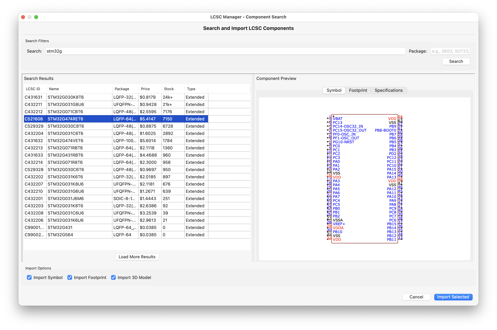

# KiCad LCSC Manager Plugin

A KiCad plugin that allows you to search and import electronic components from LCSC/EasyEDA and JLCPCB directly into your KiCad projects, including symbols, footprints, and 3D models.

## Features

- 🔍 Search components by LCSC part number
- 📦 Automatically download symbols, footprints, and 3D models (WRL and STEP formats)
- 💰 Real-time stock, pricing, and datasheet information from JLCPCB API
- 📚 Add components to project-specific libraries
- ⚠️ Smart overwrite detection with selective import options
- 🎨 Seamless integration with KiCad 9.0+
- 🔄 Support for both LCSC/EasyEDA and JLCPCB parts

## Installation

### From KiCad Plugin Manager (Recommended)
1. Open KiCad
2. Go to **Tools → Plugin and Content Manager**
3. Search for **"LCSC Manager"**
4. Click **Install**
5. Restart KiCad

### Manual Installation
1. Download the [latest release](https://github.com/hulryung/kicad-lcsc-manager/releases)
2. Extract the ZIP file to your KiCad plugins directory:
   - **Windows**: `C:\Users\[USERNAME]\Documents\KiCad\[VERSION]\scripting\plugins\`
   - **macOS**: `~/Documents/KiCad/[VERSION]/scripting/plugins/`
   - **Linux**: `~/.kicad/scripting/plugins/`
3. Restart KiCad

For detailed installation instructions, see [INSTALL.md](INSTALL.md)

## Screenshots



*Import components from LCSC/EasyEDA with real-time stock and pricing information*

## Usage

1. Open a KiCad project (PCB Editor or Symbol Editor)
2. Click the LCSC Manager icon in the toolbar
3. Enter an LCSC part number (e.g., **C2040** for RP2040)
4. Click **Search** to fetch component information
5. Review the component details:
   - Part name and manufacturer
   - Package type
   - JLCPCB stock availability
   - Extended/Basic part classification
6. Select import options (Symbol, Footprint, 3D Model)
7. Click **Import** to add the component to your project libraries
8. The component will be available in:
   - Symbol: `<project>/libs/lcsc/symbols/lcsc_imported.kicad_sym`
   - Footprint: `<project>/libs/lcsc/footprints.pretty/`
   - 3D Models: `<project>/libs/lcsc/3dmodels/`

## Requirements

- KiCad 6.0 or later
- Python 3.8+
- Internet connection for downloading components

## Development

### Setup Development Environment

```bash
# Clone the repository
git clone https://github.com/hulryung/kicad-lcsc-manager.git
cd kicad-lcsc-manager

# Install dependencies
pip install -r requirements.txt

# Run tests
python -m pytest tests/
```

### Project Structure

```
kicad-lcsc-manager/
├── plugins/lcsc_manager/    # Main plugin code
├── tests/                   # Unit tests
├── requirements.txt         # Python dependencies
└── README.md               # This file
```

## Credits

This plugin is inspired by and references:
- [easyeda2kicad.py](https://github.com/uPesy/easyeda2kicad.py) - CLI tool for converting LCSC components
- [easyeda2kicad_plugin](https://github.com/rasmushauschild/easyeda2kicad_plugin) - KiCad plugin wrapper
- [KiCAD-EasyEDA-Parts](https://github.com/Yanndroid/KiCAD-EasyEDA-Parts) - Alternative implementation

## License

MIT License - see LICENSE file for details

## Contributing

Contributions are welcome! Please feel free to submit a Pull Request.

## Support

If you encounter any issues or have questions, please [open an issue](https://github.com/hulryung/kicad-lcsc-manager/issues) on GitHub.
