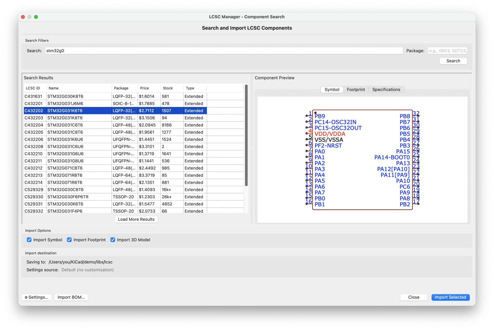

# KiCad LCSC Manager

A KiCad plugin to search LCSC/JLCPCB parts and import their symbols,
footprints and 3D models from EasyEDA straight into your project's
libraries.



What changed in each release: [CHANGELOG.md](CHANGELOG.md) and the
[Releases page](https://github.com/hulryung/kicad-lcsc-manager/releases).

## Features

- **Search** LCSC by part name, value or LCSC number (`RP2040`, `10uF`,
  `C2040`), optionally filtered by package. Results show package, price,
  stock and Basic/Extended type; click a column header to sort, and load
  more pages as you go.
- **Preview** before importing: EasyEDA's own symbol and footprint drawings,
  plus a specifications tab with the part's parameters, datasheet and LCSC
  product page. Previews load in the background, so you can keep browsing.
- **Import** the symbol, the footprint and the 3D model (STEP and WRL, linked
  from the footprint). The libraries are added to KiCad's library tables for
  you.
- **Keep going:** the dialog stays open after an import, and a status line
  lists what you've imported so far.
- **Import a whole BOM:** JLCPCB, EasyEDA and KiCad BOMs with an LCSC part
  number column, in one pass.
- **Choose where parts go:** inside each project (the default) or one shared
  library folder for all projects, with settings per project or global.
- Runs on Windows, macOS and Linux with KiCad 9 and 10, and has a build for
  KiCad 11 (in development).

## Installation

LCSC Manager isn't in KiCad's official add-on repository ([why](#why-isnt-it-in-kicads-official-repository)),
but it has its own repository that gives you the same one-click install and
update notifications.

1. Open the **Plugin and Content Manager**: the button in the main KiCad
   window, or **Tools → Plugin and Content Manager** in an editor. (On some
   macOS builds it's only in the main window.)
2. Click **Manage…** (bottom left), then **Add Repository**, paste this URL
   and click **OK**:
   ```
   https://raw.githubusercontent.com/hulryung/kicad-lcsc-manager/main/repository.json
   ```
3. Close the repository manager and pick **LCSC Manager** in the repository
   drop-down at the top.
4. Select **LCSC Manager**, click **Install**, then **Apply Pending Changes**.
5. Quit and restart KiCad. If the plugin doesn't show up, see
   [Troubleshooting](INSTALL.md#troubleshooting).

> **Which build you get:** every release comes in two builds, and the
> repository offers the one that fits your KiCad. KiCad 9 and 10 get the 0.x
> build. KiCad 11 drops the Python scripting API that build uses, so it gets
> the 1.x build of the same release, which runs through KiCad's IPC API
> instead. When you install that one, KiCad offers to turn on its API
> server; say yes, or turn it on later under **Preferences → Plugins**.

**Manual installation** (KiCad 9 or 10): download `kicad-lcsc-manager-X.Y.Z.zip`
from the [Releases page](https://github.com/hulryung/kicad-lcsc-manager/releases)
and copy everything *inside* its `plugins/` folder into a folder named
`lcsc_manager` under `3rdparty/plugins/` in your KiCad documents folder
(e.g. `~/Documents/KiCad/10.0/3rdparty/plugins/lcsc_manager/` on macOS). Don't
unzip it there as-is: a folder named `plugins` won't load. For KiCad 11, use
the `-ipc.zip` with the Plugin and Content Manager's **Install from File…**
instead. [INSTALL.md](INSTALL.md) has the paths for every platform and
troubleshooting steps.

**Linux:** component previews need wxPython's WebView package
(`sudo apt install python3-wxgtk-webview4.0` on Debian/Ubuntu,
`sudo dnf install python3-wxpython4-webview` on Fedora). Without it
everything else works, and the previews show a placeholder.

## Usage

### Opening LCSC Manager

Open a **saved** project, then:

- **KiCad 9 and 10:** in the **PCB Editor**, click the LCSC Manager toolbar
  button or choose **Tools → External Plugins → LCSC Manager**. These KiCad
  versions only run Python plugins in the PCB Editor. Imported symbols still
  go to the project's symbol library, for use in the Schematic Editor.
- **KiCad 11:** click the toolbar button in the **PCB Editor** or the
  **Schematic Editor**.

### Searching and importing

1. Type a part name, value or LCSC number and press **Enter**. Add a package
   (`0603`, `SOT23`, `LQFP`) to narrow the results.
2. Select a result to see its symbol, footprint and specifications.
3. Choose what to import (symbol, footprint, 3D model) and click
   **Import Selected**.
4. Search and import as many parts as you like; click **Close** when done.

**Import destination** at the bottom of the dialog shows where parts will
go. By default that's inside the project:

| What | Where | Library name |
| --- | --- | --- |
| Symbols | `<project>/libs/lcsc/symbols/lcsc_imported.kicad_sym` | `lcsc_imported` |
| Footprints | `<project>/libs/lcsc/footprints.pretty/` | `lcsc_footprints` |
| 3D models | `<project>/libs/lcsc/3dmodels/` | |

KiCad doesn't always pick up a new library at once, and the dialog tells you
when that's the case:

- **Symbols:** if the Schematic Editor was already open, reopen it.
- **Footprints on KiCad 10 and 11:** the first time a project gets the
  footprint library, reopen the project (or restart KiCad) before placing
  them. KiCad 9 picks it up straight away.
- **Shared library folder:** restart KiCad once after the first import.

### Importing a BOM

1. Click **Import BOM…** in the search dialog and pick the file. A JLCPCB
   assembly BOM, or any CSV/EasyEDA/KiCad BOM with an LCSC part number column
   (`LCSC Part #`, `LCSC Part Number`, `LCSC`, …), works as is. `.xlsx` files
   need the optional `openpyxl` package; otherwise export the BOM as CSV.
2. Check the list: repeated parts are merged, and rows without an LCSC number
   are skipped and reported. Untick anything you don't want, and choose
   symbols, footprints and/or 3D models.
3. Click **Import**. You can cancel along the way, and a summary lists what
   was imported and what failed.

BOM imports use the same library location and settings as single parts.

### Library location and settings

Click **⚙ Settings…** in the search dialog.

**Library location**

- **Inside each project** (default): every project keeps its own copy under
  `<project>/libs/lcsc`, referenced as `${KIPRJMOD}/...` in the project's own
  library tables. Easy to commit with the project.
- **One shared folder for all projects:** every import goes to one folder of
  your choice, registered in KiCad's **global** library tables, so parts
  imported in one project are available in all of them. Use a full path
  (`~/KiCad/lcsc`, `C:\KiCadLibs\lcsc`) or a KiCad path variable
  (`${MY_LIBS}/lcsc`, defined under *Preferences → Configure Paths*). A
  variable is kept as is in the library tables and footprints, so they keep
  working if the folder moves or the project is opened on another machine
  that defines it.

  The shared libraries are named `lcsc_shared` (symbols) and
  `lcsc_shared_footprints` (footprints), so a project with its own
  `lcsc_imported` / `lcsc_footprints` can't shadow them. Before its first
  change to a global table, LCSC Manager saves a copy as
  `sym-lib-table.lcsc_manager.bak` / `fp-lib-table.lcsc_manager.bak`, and it
  never modifies a library entry it didn't create.

A project can override the location. For example, a team repository can
commit its own libraries while your personal projects use the shared folder.
The shared folder itself is always a global setting, since it's a location on
your computer.

**Layout** (inside-each-project location)

| Setting | Default | Meaning |
| --- | --- | --- |
| `library_path` | `libs/lcsc` | Root folder, relative to the project |
| `symbol_lib_name` | `lcsc_imported.kicad_sym` | Symbol library file |
| `footprint_lib_name` | `footprints.pretty` | Footprint library folder |
| `model_3d_path` | `3dmodels` | 3D model folder |

**Where settings are saved**

- **Global:** `~/.kicad/lcsc_manager/config.json`, the default for every
  project.
- **This project only:** `<project>/.lcsc_manager.json`, which overrides
  Global for that project. Commit it to share the layout with your team, or
  add it to `.gitignore` if it's personal.

Settings resolve as default → global → project; a project stores only the
values that differ from Global. The Settings dialog shows a live preview of
the resulting paths and where each value comes from. Changes apply to future
imports; existing libraries aren't moved.

### Tips

- An LCSC number (`C2040`) finds exactly that part.
- Values such as `10uF`, `100nF` or `10k` plus a package (`0603`, `0805`)
  find passives quickly.
- Basic parts are usually cheaper to assemble at JLCPCB than Extended ones.

## Updating and uninstalling

Installed through the Plugin and Content Manager, new versions show up there
as updates. To uninstall, open its **Installed** tab, uninstall
**LCSC Manager** and click **Apply Pending Changes**. For a manual
installation, replace or delete the `lcsc_manager` folder.

Your settings and logs are in `~/.kicad/lcsc_manager/`; delete that folder
too for a clean removal. Imported libraries and `.lcsc_manager.json` files
stay in your projects.

## Requirements

- **KiCad** 9 or 10 (0.x build), or 11, still in development (1.x build,
  with KiCad's API server turned on). KiCad 7 and 8 aren't supported.
- **An internet connection**, to search and download parts. The KiCad 11
  build also needs it the first time, when KiCad installs the plugin's one
  dependency (`kicad-python`).
- **Nothing to install with pip:** `requests` and its dependencies ship with
  the plugin.
- **Linux, optional:** wxPython's WebView package for previews (see
  [Installation](#installation)).

## FAQ

### Why isn't it in KiCad's official repository?

KiCad's [commercial services policy](https://dev-docs.kicad.org/en/addons/index.html#_commercial_services)
requires a formal contract between the service provider and the KiCad team
for add-ons that integrate directly with a commercial API such as
LCSC/JLCPCB. That's not something a third-party developer can arrange, so the
plugin is distributed through its own repository instead.

### Why does it only show up in the PCB Editor?

On KiCad 9 and 10 Python plugins only run in the PCB Editor. The KiCad 11
build can also be started from the Schematic Editor.

### I imported a footprint, but KiCad can't find it

On KiCad 10 and 11 a running session doesn't reload the project's footprint
library table, so a library added during the session appears only after the
project is reopened. The dialog says so when this applies. See
[Searching and importing](#searching-and-importing).

### The previews don't show

Previews come from EasyEDA, so check your internet connection; some parts
have no preview data there. On Linux, install the WebView package (see
[Installation](#installation)) and restart KiCad.

### The dialog only has an "LCSC Part Number" field

That's the basic fallback dialog, used when the full search dialog can't
load. A message explains why, usually a missing Python package, and how to
fix it. The log has the details.

### Where is the log?

`~/.kicad/lcsc_manager/logs/lcsc_manager.log`. Please attach it when you
[open an issue](https://github.com/hulryung/kicad-lcsc-manager/issues).
[docs/DEBUG.md](docs/DEBUG.md) has more ways to track a problem down.

## Development

```
kicad-lcsc-manager/
├── plugins/lcsc_manager/   the plugin package that gets installed
│   ├── plugin.py           entry point for KiCad 9/10 (SWIG action plugin)
│   ├── ipc_main.py         entry point for KiCad 11 (IPC API plugin)
│   ├── launcher.py         opens the dialogs for both
│   ├── dialog*.py          search, basic, settings and BOM dialogs
│   ├── api/                LCSC/EasyEDA and JLCPCB clients
│   ├── converters/         symbol, footprint and 3D model conversion
│   ├── library/            library files and KiCad library tables
│   ├── bom/                BOM parsing and batch import
│   ├── utils/              settings, KiCad host detection, logging
│   ├── vendor/             vendored easyeda2kicad.py (footprint conversion)
│   └── lib/                bundled dependencies (not in git)
├── ipc/                    plugin.json and requirements.txt for the KiCad 11 build
├── scripts/                dependency bundling, packaging and release scripts
├── tests/                  tests
└── docs/                   packaging and debugging notes
```

- `./scripts/bundle-dependencies.sh` fills `plugins/lcsc_manager/lib/`, which
  the plugin needs to run.
- Tests are plain scripts: `python3 tests/test_<name>.py`. [TESTING.md](TESTING.md)
  covers the headless checks against KiCad and how to try the KiCad 11 build.
- A `vX.Y.Z` tag releases both builds; see [docs/PACKAGING.md](docs/PACKAGING.md).
  `./scripts/package.sh X.Y.Z` builds the same packages locally.

Contributions are welcome; please open an issue or a pull request.

## Related projects

- [EasyEDA2KiCad Web](https://github.com/hulryung/easyeda2kicad-web): convert
  EasyEDA/LCSC parts to KiCad in the browser, with 2D and 3D previews.
- [BOM Extender](https://github.com/hulryung/bom-extender): add LCSC stock
  and pricing to a BOM and export it.

## Credits

- [easyeda2kicad.py](https://github.com/uPesy/easyeda2kicad.py) by uPesy
  (AGPL-3.0). Footprint conversion uses a vendored copy of v1.0.1
  (`plugins/lcsc_manager/vendor/easyeda2kicad/`). The 3D model conversion
  (WRL generation, materials, vertices, centering), multi-unit symbol pin
  numbering and the macOS certificate fallback are ported from it, each
  marked in its docstring.
- [JLC2KiCad_lib](https://github.com/TousstNicolas/JLC2KiCad_lib) (MIT): the
  symbol handlers started from its code.
- [easyeda2kicad_plugin](https://github.com/rasmushauschild/easyeda2kicad_plugin)
  and [KiCAD-EasyEDA-Parts](https://github.com/Yanndroid/KiCAD-EasyEDA-Parts):
  earlier plugins that shaped this one.

## License

The plugin is MIT-licensed ([LICENSE](LICENSE)). Its footprint conversion
is a vendored copy of easyeda2kicad.py, which stays under AGPL-3.0, and parts
of the other conversion code are ported from it (each marked in its
docstring). If you redistribute the plugin, review both licenses; see
[NOTICE.md](NOTICE.md).
